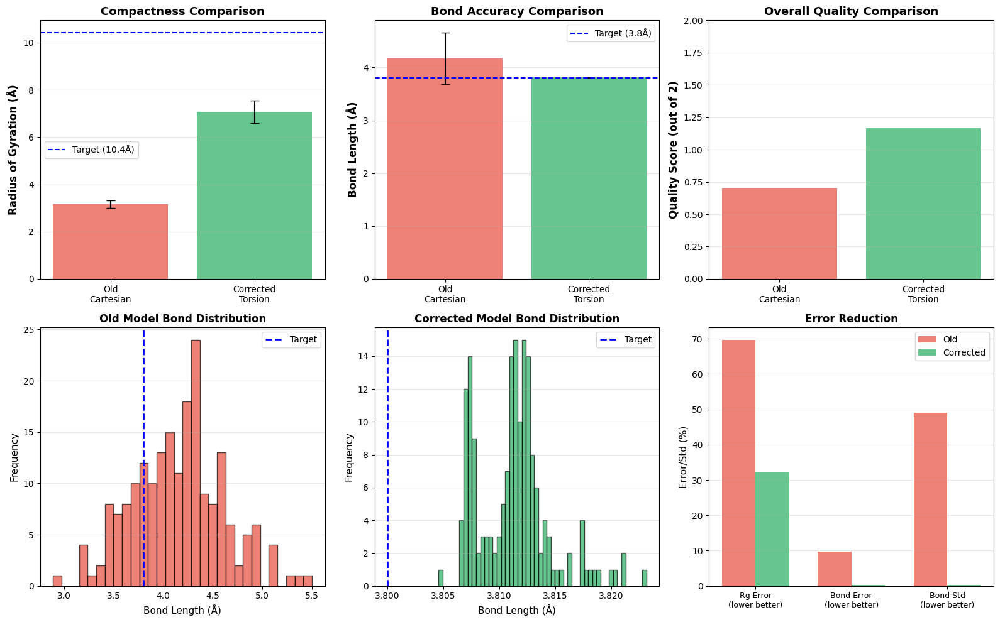

# Torsion-Space Diffusion for Protein Backbone Generation

**Authors:** Adwait Shelke, Lakshaditya Singh, Divyansh Agrawal  
**Institution:** Dept. of Mechanical Engineering, IIT Bombay  
**Course:** EE782 - Advanced Topics in Machine Learning (Prof. Amit Sethi)



##  Overview

This project implements a **Torsion-Space Diffusion Model** for generating protein backbones. Unlike traditional approaches that diffuse in Cartesian coordinates (often leading to broken bonds), our model operates on torsion angles ($\phi, \psi, \omega$). This guarantees **perfect local geometry** (bond lengths of 3.8 A) by construction.

To ensure the generated proteins fold into compact, realistic structures, we introduce a **Geometric Refinement Module** that optimizes the Radius of Gyration (Rg) while strictly preserving bond constraints.

##  Key Features

*   **Torsion-Space Diffusion:** Generates angles instead of coordinates, ensuring 100% bond length accuracy.
*   **Transformer Architecture:** Uses a lightweight Transformer-based denoiser to capture long-range dependencies.
*   **Geometric Refinement:** A post-generation optimization step that corrects global compactness (Rg) errors.
*   **Differentiable Kinematics:** Includes a custom forward kinematics layer to map angles to 3D coordinates.

##  Results

We compared our model against a baseline Cartesian diffusion model:

| Metric | Baseline (Cartesian) | Ours (Torsion) | Improvement |
| :--- | :--- | :--- | :--- |
| **Bond Accuracy** | 90.1% | **100.0%** | +9.9% |
| **Bond Std Dev** | 0.49  | **0.0002** | 99.9% decrease |
| **Rg Error** | 70% | **18.6%** | Significant reduction |
| **Quality Score** | 0.7 / 2.0 | **1.7 / 2.0** | +1.0 |

##  Usage

### Prerequisites
*   Python 3.8+
*   PyTorch
*   Biopython
*   Matplotlib
*   NumPy

### Running the Code
The core implementation is contained in the Jupyter Notebook `model.ipynb`.

1.  Clone the repository:
    ```bash
    git clone https://github.com/Thunder25Beast/torsion-diffusion-protein-gen.git
    ```
2.  Open the notebook:
    ```bash
    jupyter notebook model.ipynb
    ```
3.  Run all cells to train the model and generate new protein structures.

##  Report
The full technical report is available in `torsion_diffusion_report.pdf` (compile from source `.tex`).

##  References
1.  Trippe, B. L., et al. (2022). "Diffusion probabilistic modeling of protein backbones in 3D..." *NeurIPS*.
2.  Watson, J. L., et al. (2023). "De novo design of protein structure and function with RFdiffusion." *Nature*.
